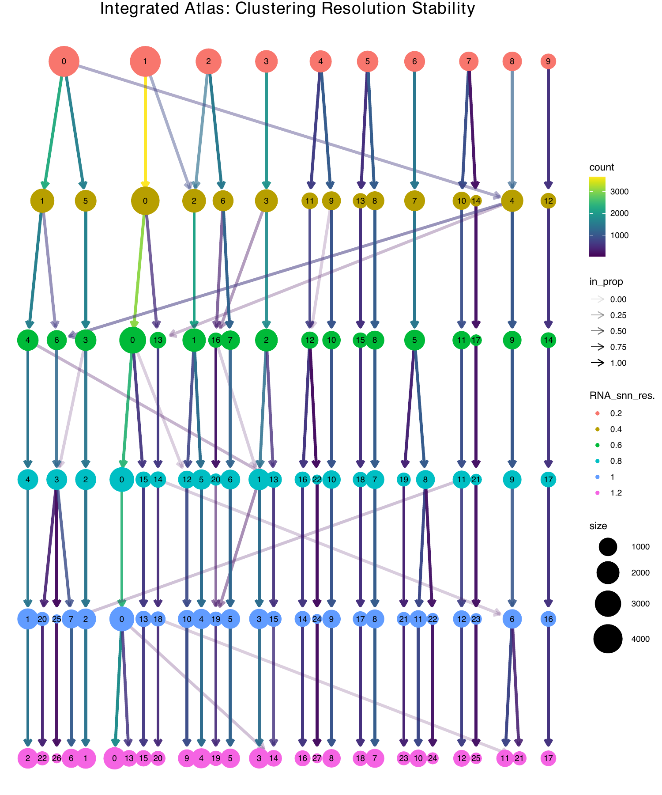
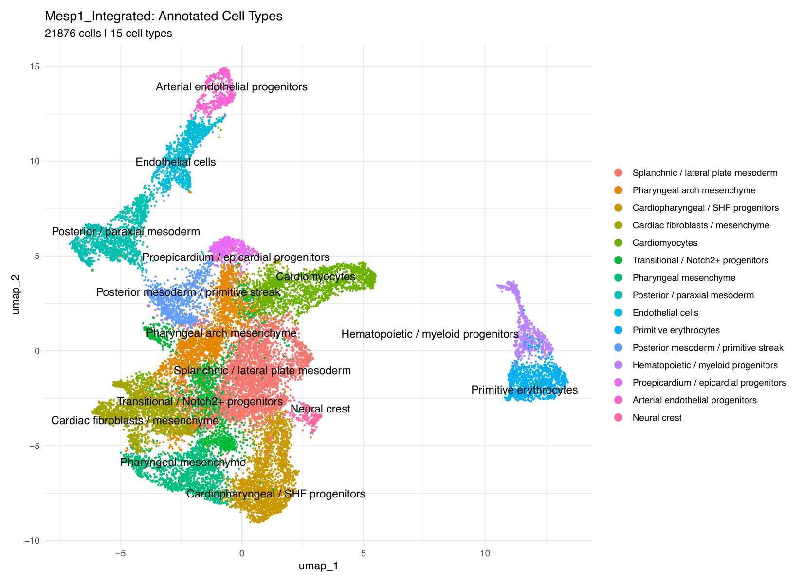
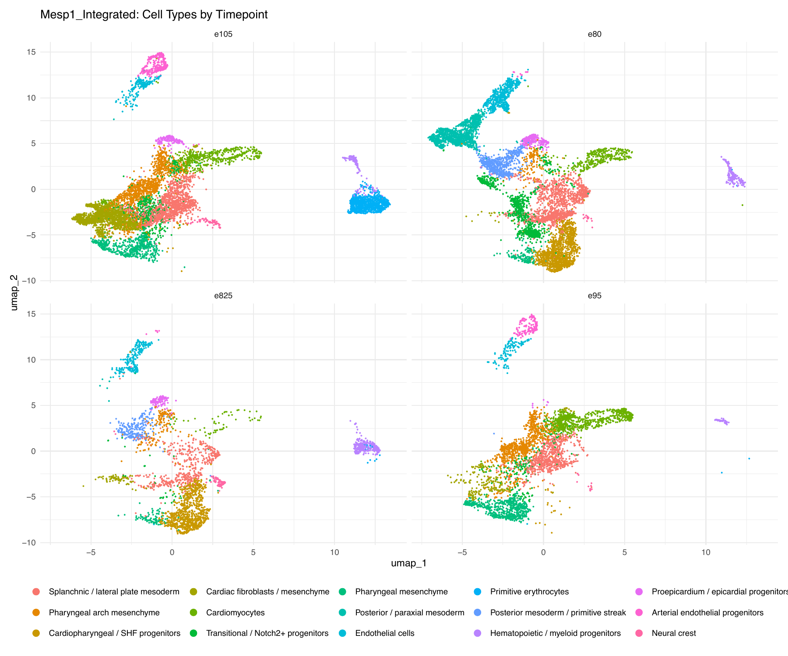

# Mesp1 Cardiopharyngeal Lineage — Single-Cell RNA-seq Pipeline


**Mesp1** is a transiently expressed bHLH transcription factor that marks the 
earliest committed cardiovascular progenitors in the mouse embryo (E6.5–E7.5).
Lineage tracing demonstrates that Mesp1-expressing cells give rise to the 
majority of cardiomyocytes, endothelial cells, smooth muscle cells, and 
hematopoietic progenitors — essentially the entire heart and great vessels 
([Bondue & Blanpain, 2010](https://doi.org/10.1161/CIRCRESAHA.110.227058);
[Lescroart et al., 2014](https://doi.org/10.1038/ncb3024)). Mesp1 acts as a 
master regulator of cardiovascular progenitor specification, directly activating 
core cardiac transcription factors and promoting epithelial-mesenchymal transition 
during progenitor migration 
([Bondue et al., 2008](https://doi.org/10.1016/j.stem.2008.06.009)). Critically, 
temporally distinct waves of Mesp1 progenitors exhibit different lineage 
restrictions, suggesting that fate diversity emerges early during specification 
rather than from a homogeneous pool 
([Lescroart et al., 2014](https://doi.org/10.1038/ncb3024)).

Understanding *how* this transcriptional diversity unfolds across developmental 
time — and *when* individual lineages become committed — requires resolving 
heterogeneity at single-cell resolution across the specification window. This 
pipeline provides an alternative analysis of the Mesp1 single-cell dataset from 
[Nomaru et al. (2021)](https://doi.org/10.1038/s41467-021-26966-6), 
characterizing Mesp1-lineage cells across four embryonic timepoints 
(E8.0 → E10.5) and integrating all timepoints into a single developmental atlas. 
Where the original study used Scran/densityClust/Scanpy, this pipeline uses a 
Seurat/Nextflow toolchain — methodological divergences are documented throughout.

---

## Table of Contents

- [Background](#background)
- [Requirements](#requirements)
- [Installation](#installation)
- [Usage](#usage)
- [Pipeline Architecture](#pipeline-architecture)
  - [Phase 1 — Per-Timepoint QC & Clustering](#phase-1--per-timepoint-qc--clustering)
  - [Phase 2 — Per-Timepoint Annotation](#phase-2--per-timepoint-annotation)
  - [Phase 3a — Cross-Timepoint Integration (fastMNN)](#phase-3a--cross-timepoint-integration-fastmnn)
- [Integration QC Approach](#integration-qc-approach)
- [Output Structure](#output-structure)
- [Parameters](#parameters)
- [Execution Profiles](#execution-profiles)
- [Cluster Annotations](#cluster-annotations)
- [Integration artifact recovery: cluster 3](#integration-artifact-recovery-cluster-3)
- [Integrated Atlas Annotations](#integrated-atlas-annotations)
- [Citation](#citation)

---

## Why the pipeline is built this way

**Phased design.** The pipeline separates per-timepoint QC/clustering (Phase 1), 
biological annotation (Phase 2), and cross-timepoint integration (Phase 3a) into 
three independent Nextflow workflows. This is a deliberate architectural choice: 
annotation is an iterative, knowledge-driven process that will be revised as 
marker biology is interrogated — it does not belong in the same "set and forget" 
phase as QC thresholds and clustering parameters. The phase boundary at 
`06_seurat_clustered.rds` means annotation can be re-run cheaply via `-resume` 
without re-running expensive upstream steps.

**Integration method choice.** Phase 3a uses fastMNN (mutual nearest neighbors) 
specifically because the Mesp1 *control* timecourse contains homogeneous cell 
types — a cardiomyocyte at E9.5 is transcriptionally concordant with a 
cardiomyocyte at E10.5, differing primarily in batch rather than biology. fastMNN 
is designed for this case: it finds shared cell types across datasets and corrects 
batch while preserving real developmental differences. The alternative methods 
used in the companion Tbx1 pipeline (perturbation-preserving alignment) would be 
inappropriate here because they are designed for heterogeneous conditions where 
the inter-dataset difference is the biological signal of interest, not noise to 
be removed.

**Log-normalization for fastMNN, not SCTransform.** Phase 3a uses 
`NormalizeData` + `FindVariableFeatures` rather than SCTransform, because fastMNN 
was designed and benchmarked on log-normalized input. SCTransform → fastMNN is an 
off-label combination with no strong precedent; log-normalization is the validated 
route. Per-timepoint SCTransform in Phase 1 serves a different purpose (QC and 
initial clustering) and is not reused as integration input.

**Fan-in topology.** The four `PREP_NORMALIZE` processes run in parallel 
(controlled by `maxForks` in the execution profile), then their outputs are 
`.collect()`'d into a single `INTEGRATE_FASTMNN` process. This is standard 
Nextflow fan-in; the key guard is a `stopifnot()` in `02_integrate_fastmnn.R` 
that asserts cell-barcode order is identical between the fastMNN output and the 
merged Seurat object before the corrected embedding is inserted.

---

## Requirements

| Tool          | Version       | Purpose                                         |
|---------------|---------------|-------------------------------------------------|
| Nextflow      | >= 26.04.0    | Pipeline orchestration                          |
| conda         | >= 23.0       | Environment management                          |
| R             | >= 4.3.0      | Analysis runtime                                |
| Seurat        | 5.x           | Single-cell analysis framework                  |
| batchelor     | (Bioconductor) | fastMNN batch correction (Phase 3a only)       |
| BiocParallel  | (Bioconductor) | Parallel backend for fastMNN (Phase 3a only)   |

**Hardware:**

| Profile          | Minimum RAM | Recommended         |
|------------------|-------------|---------------------|
| `low_mem`        | 8 GB        | Standard laptop/PC  |
| `apple_silicon`  | 32 GB       | M-series Mac        |
| `hpc`            | 64 GB       | SLURM cluster       |

Phase 3a (fastMNN integration of 4 timepoints) is the most memory-intensive step.
On `apple_silicon`, `INTEGRATE_FASTMNN` is allocated up to 48 GB; on `hpc`, up to 96 GB.

**Disk space:** ~100 GB (raw data × 4 timepoints + work directories + results)

---

## Installation

```bash
# 1. Clone the repository
git clone https://github.com/drgideonobeng/mesp1.git
cd mesp1

# 2. Create and activate the conda environment
conda env create -f env.yml
conda activate multiome

# 3. Verify Nextflow is available
nextflow -version
```

---

## Usage

Phases run independently and must be executed in order. Each phase reads outputs
from the previous one; use `-resume` freely after any failure.

### Phase 1 — QC, normalization, and clustering (run once per timepoint)

```bash
# E8.0
nextflow run phase1/main.nf -profile conda,apple_silicon \
    -params-file phase1/params/mesp1_E80.yml

# E8.25
nextflow run phase1/main.nf -profile conda,apple_silicon \
    -params-file phase1/params/mesp1_E825.yml

# E9.5
nextflow run phase1/main.nf -profile conda,apple_silicon \
    -params-file phase1/params/mesp1_E95.yml

# E10.5
nextflow run phase1/main.nf -profile conda,apple_silicon \
    -params-file phase1/params/mesp1_E105.yml
```

### Phase 2 — Marker genes and per-timepoint annotation (run once per timepoint)

Phase 2 requires the Phase 1 `06_seurat_clustered.rds` for each timepoint.
Update `config/cluster_labels/<timepoint>.csv` before running ANNOTATE_CLUSTERS.

```bash
nextflow run phase2/main.nf -profile conda,apple_silicon \
    -params-file phase2/params/mesp1_E95.yml
```

### Phase 3a — Cross-timepoint integration atlas

Phase 3a requires `04_seurat_filtered.rds` from Phase 1 for **all four** timepoints.
Fill in `phase3a/cluster_labels_atlas.csv` before running ANNOTATE_ATLAS.

```bash
nextflow run phase3a/main.nf -profile conda,apple_silicon \
    -params-file phase3a/params/mesp1-timecourse.yml
```

### Resume after a failure

```bash
nextflow run phase3a/main.nf -profile conda,apple_silicon \
    -params-file phase3a/params/mesp1-timecourse.yml -resume
```

---

## Pipeline Architecture

The pipeline is split into three independent Nextflow workflows that share results
on disk. Run them in order: Phase 1 → Phase 2 → Phase 3a.

```
 ┌──────────────────────────────────────────────────────────────────┐
 │  PHASE 1  (runs 4× independently, once per timepoint)            │
 │                                                                  │
 │  GEO Download → Seurat Object → QC Visualize → Filter Cells      │
 │       → SCTransform Normalize → Dim Reduction/Cluster → Clustree │
 └──────────────────────────────────────────────────────────────────┘
           │                  │ 06_seurat_clustered.rds
           │ 04_seurat_filtered.rds
           ▼                  ▼
 ┌─────────────────┐  ┌──────────────────────────────────────────┐
 │  PHASE 3a       │  │  PHASE 2  (per-timepoint annotation)     │
 │  (integration)  │  │                                          │
 └─────────────────┘  │  Find Markers → Plot Marker Genes        │
                       │       → Annotate Clusters                │
                       └──────────────────────────────────────────┘
```

### Phase 1 — Per-Timepoint QC & Clustering

**Directory:** `phase1/`  
**Input:** Raw GEO count matrices (barcodes, features, matrix)  
**Output:** `06_seurat_clustered.rds` and `04_seurat_filtered.rds` per timepoint  
**Normalization:** SCTransform with `percent.mt` regression

```
DOWNLOAD_DATA
      │
      ▼
CREATE_SEURAT_OBJECT        Build Seurat object from 10x sparse matrix
      │
      ▼
VISUALIZE_QC                Compute QC metrics; violin and scatter plots
      │
      ▼
FILTER_CELLS                Remove low-quality cells (nFeature, mt%)
      │
      ▼
NORMALIZE_DATA              SCTransform normalization; variable features
      │
      ▼
DIM_REDUCTION_AND_CLUSTER   PCA → UMAP; Louvain clustering
      │
      ▼
RUN_CLUSTREE                Resolution stability across 0.1–1.2
```

| Step | Process                   | Output                                |
|------|---------------------------|---------------------------------------|
| 01   | DOWNLOAD_DATA             | Raw `.tsv.gz` and `.mtx.gz` files     |
| 02   | CREATE_SEURAT_OBJECT      | `02_seurat_unfiltered.rds`            |
| 03   | VISUALIZE_QC              | `03_seurat_with_qc.rds`, `03_qc_plots.pdf` |
| 04   | FILTER_CELLS              | `04_seurat_filtered.rds`              |
| 05   | NORMALIZE_DATA            | `05_seurat_normalized.rds`            |
| 06   | DIM_REDUCTION_AND_CLUSTER | `06_seurat_clustered.rds`, `06_elbow.pdf`, `06_umap.pdf` |
| 07   | RUN_CLUSTREE              | `07_clustree_resolutions.pdf`         |

### Phase 2 — Per-Timepoint Annotation

**Directory:** `phase2/`  
**Input:** `06_seurat_clustered.rds` from Phase 1  
**Output:** `03_seurat_annotated.rds` per timepoint

```
FIND_MARKERS        Wilcoxon rank-sum; all clusters vs. rest
      │
      ▼ (also runs in parallel with FIND_MARKERS)
PLOT_MARKER_GENES   Feature plots for selected genes
      │
      ▼
ANNOTATE_CLUSTERS   Apply labels from cluster_labels/<timepoint>.csv
```

| Step | Process            | Output                                         |
|------|--------------------|------------------------------------------------|
| 01   | FIND_MARKERS       | `01_all_markers.csv`, `01_top_5_markers_per_cluster.csv` |
| 02   | PLOT_MARKER_GENES  | `02_marker_feature_plots.pdf`                  |
| 03   | ANNOTATE_CLUSTERS  | `03_seurat_annotated.rds`, `03_umap_annotated.pdf` |

### Phase 3a — Cross-Timepoint Integration (fastMNN)

**Directory:** `phase3a/` 
**Input:** `04_seurat_filtered.rds` from Phase 1 for all four timepoints 
**Output:** Joint atlas with MNN-corrected embedding, UMAP, clusters, and marker genes 
**Normalization:** LogNormalize + VST variable features (not SCTransform — required for fastMNN) 
**Integration:** fastMNN via `batchelor::fastMNN()` with 50 internal PCA dims; 3000 shared HVGs; k = 20 MNNs

The workflow uses a **fan-out → fan-in** topology: the four normalization jobs run in
parallel, then all outputs are collected before `INTEGRATE_FASTMNN` begins.
After clustering, `RUN_CLUSTREE` and `ANNOTATE_ATLAS` run in parallel on the same object.

```
PREP_NORMALIZE (×4, parallel)   LogNormalize + VST per timepoint
          │ (collect all 4)
          ▼
INTEGRATE_FASTMNN               fastMNN batch correction → 50 MNN dims
          │
          ▼
CLUSTER_INTEGRATED              FindNeighbors/FindClusters on MNN dims;
          │                     UMAP; timepoint composition table
          │
    ┌─────┴──────┐
    ▼            ▼
RUN_CLUSTREE  ANNOTATE_ATLAS    (parallel)
```

| Step | Process             | Output                                              |
|------|---------------------|-----------------------------------------------------|
| 01   | PREP_NORMALIZE      | `01_<sample>_normalized.rds` (×4)                   |
| 02   | INTEGRATE_FASTMNN   | `02_seurat_integrated.rds`, `02_mnn_elbow.pdf`      |
| 03   | CLUSTER_INTEGRATED  | `03_seurat_clustered.rds`, `03_umap_clusters.pdf`, `03_umap_samples.pdf`, `03_timepoint_composition.csv` |
| 04   | RUN_CLUSTREE        | `04_clustree_resolutions.pdf`                       |
| 05   | ANNOTATE_ATLAS      | `05_seurat_annotated.rds`, `05_umap_annotated.pdf`, `05_umap_timepoints.pdf`, `05_all_markers.csv`, `05_top_5_markers_per_celltype.csv` |

#### Resolution selection



*Resolution 0.4 selected as the stable inflection point — sub-cluster splits below this resolution are stochastic, splits above introduce small unstable groups.*

---

## Integration QC Approach

Good integration means timepoints intermix in biologically meaningful clusters without
erasing real developmental structure. Use these outputs from Phase 3a to evaluate:

**1. Sample UMAP (`03_umap_samples.pdf`)** 
The primary QC plot. Color cells by `sample_id`. Well-integrated data shows interdigitation
of E8.0/E8.25/E9.5/E10.5 within shared clusters. Remaining timepoint blobs indicate residual
batch effects — increase `mnn_k` (default: 20) to force more mixing, or inspect whether
the separation is biologically real (e.g., a cell type genuinely absent at early stages).

**2. Timepoint composition table (`03_timepoint_composition.csv`)** 
Reports how many cells from each timepoint contribute to each Louvain cluster. Expect
progenitor clusters to be enriched at E8.0/E8.25 and more differentiated clusters at
E9.5/E10.5. Complete single-timepoint dominance of a shared cluster is a red flag for
inadequate integration.

**3. Clustree on MNN space (`04_clustree_resolutions.pdf`)** 
Same interpretation as Phase 1: look for stable resolution ranges where clusters do not
fragment dramatically. Phase 3a default is `cluster_res = 0.4`; use clustree output to
confirm this is a stable point before committing to annotation.

**4. MNN elbow plot (`02_mnn_elbow.pdf`)** 
Saved by `02_integrate_fastmnn.R` immediately after the fastMNN call. Plots the standard
deviation of each corrected dimension across cells — the standard proxy for variance
explained, since fastMNN does not return percent-variance-explained in the PCA sense.
The MNN embedding has 50 internal dims; `mnn_dims = 30` are used for graph construction
and UMAP. If the elbow drops sharply before 30, lower `mnn_dims` in
`phase3a/nextflow.config` and re-run from step 03 with `-resume`.

**5. Cell-order consistency check** 
`02_integrate_fastmnn.R` includes a `stopifnot()` verifying that cell barcodes are in
identical order between the fastMNN output and the merged Seurat object. A failure here
is a pipeline bug, not a biology problem; the pipeline will halt loudly.

---

## Output Structure

Results are written per-timepoint for Phases 1–2, and to a shared directory for Phase 3a.

```
results/
├── mesp1/
│   ├── e80/                            # Phase 1 + 2 results for E8.0
│   │   ├── objects/
│   │   │   ├── 02_seurat_unfiltered.rds
│   │   │   ├── 03_seurat_with_qc.rds
│   │   │   ├── 04_seurat_filtered.rds  ← Phase 3a reads this
│   │   │   ├── 05_seurat_normalized.rds
│   │   │   ├── 06_seurat_clustered.rds ← Phase 2 reads this
│   │   │   └── 03_seurat_annotated.rds (Phase 2 output)
│   │   ├── plots/
│   │   └── tables/
│   ├── e825/                           # Same structure for E8.25
│   ├── e95/                            # Same structure for E9.5
│   ├── e105/                           # Same structure for E10.5
│   │
│   └── integrated/                     # Phase 3a outputs
│       ├── objects/
│       │   ├── 01_e80_normalized.rds
│       │   ├── 01_e825_normalized.rds
│       │   ├── 01_e95_normalized.rds
│       │   ├── 01_e105_normalized.rds
│       │   ├── 02_seurat_integrated.rds
│       │   ├── 03_seurat_clustered.rds
│       │   └── 05_seurat_annotated.rds
│       ├── plots/
│       │   ├── 02_mnn_elbow.pdf
│       │   ├── 03_umap_clusters.pdf
│       │   ├── 03_umap_samples.pdf
│       │   ├── 04_clustree_resolutions.pdf
│       │   ├── 05_umap_annotated.pdf
│       │   └── 05_umap_timepoints.pdf
│       ├── tables/
│       │   ├── 03_timepoint_composition.csv
│       │   ├── 05_all_markers.csv
│       │   └── 05_top_5_markers_per_celltype.csv
│       └── pipeline_info/
│           ├── phase3a_report.html
│           ├── phase3a_timeline.html
│           ├── phase3a_trace.txt
│           └── phase3a_flowchart.html
```

---

## Parameters

### Phase 1 Parameters

All parameters can be set in `phase1/nextflow.config` or overridden in a timepoint
params file (e.g., `phase1/params/mesp1_E95.yml`).

**QC Thresholds**

| Parameter        | Default | Description                                              |
|------------------|---------|----------------------------------------------------------|
| `min_cells`      | 3       | Minimum cells a gene must appear in                      |
| `min_features`   | 200     | Minimum genes per cell when building the Seurat object   |
| `min_genes`      | 200     | Lower bound for `nFeature_RNA` filter                    |
| `max_genes`      | 6000    | Upper bound for `nFeature_RNA` filter (removes doublets) |
| `max_mt_percent` | 5       | Maximum mitochondrial % (removes dying cells)            |

> **Note:** The E8.25 params override `max_mt_percent = 5` and `max_genes = 7000`.
> Inspect the QC violin plot for each timepoint before accepting the defaults.

**Clustering**

| Parameter     | Default | Description                                              |
|---------------|---------|----------------------------------------------------------|
| `pca_dims`    | 20      | PCs used for UMAP and graph (validate with elbow plot)   |
| `cluster_res` | 0.4     | Louvain resolution (validate with clustree output)       |

**Biological**

| Parameter      | Default    | Description                                          |
|----------------|------------|------------------------------------------------------|
| `species`      | `mouse`    | Used for gene name formatting                        |
| `mt_pattern`   | `^mt-`     | Mitochondrial gene prefix (`^MT-` for human)         |

### Phase 2 Parameters

Configured per-timepoint via `phase2/params/mesp1_<timepoint>.yml`.

| Parameter        | Example (E9.5)                                         | Description                       |
|------------------|--------------------------------------------------------|-----------------------------------|
| `clustered_rds`  | `results/mesp1/e95/objects/06_seurat_clustered.rds`    | Phase 1 clustered object          |
| `cluster_labels` | `config/cluster_labels/e95.csv`                        | Per-timepoint annotation CSV      |
| `marker_genes`   | `Mesp1,Prdm1,Hand2,Nkx2-6,Cldn5,Halr1`                | Genes for feature plots           |

### Phase 3a Parameters

Configured via `phase3a/params/mesp1-timecourse.yml` and `phase3a/nextflow.config`.

**Input paths**

| Parameter        | Default                                             |
|------------------|-----------------------------------------------------|
| `filtered_e80`   | `results/mesp1/e80/objects/04_seurat_filtered.rds`  |
| `filtered_e825`  | `results/mesp1/e825/objects/04_seurat_filtered.rds` |
| `filtered_e95`   | `results/mesp1/e95/objects/04_seurat_filtered.rds`  |
| `filtered_e105`  | `results/mesp1/e105/objects/04_seurat_filtered.rds` |

**Integration**

| Parameter     | Default | Description                                                 |
|---------------|---------|-------------------------------------------------------------|
| `n_features`  | 3000    | Shared HVGs selected across all timepoints for fastMNN      |
| `mnn_k`       | 20      | Mutual nearest neighbours per cell (increase to mix harder) |
| `mnn_dims`    | 30      | MNN corrected dims used for UMAP and graph construction     |
| `cluster_res` | 0.4     | Louvain resolution on integrated embedding                  |

**Atlas annotation**

| Parameter        | Default                              | Description                     |
|------------------|--------------------------------------|---------------------------------|
| `cluster_labels` | `phase3a/cluster_labels_atlas.csv`   | Atlas-level annotation CSV      |

---

## GEO Datasets

| Timepoint | GEO Accession | Description        |
|-----------|---------------|--------------------|
| E8.0      | GSM4816083    | Mesp1 E8.0         |
| E8.25     | GSM4816084    | Mesp1 E8.25        |
| E9.5      | GSM4816085    | Mesp1 E9.5         |
| E10.5     | GSM4816086    | Mesp1 E10.5        |

---

## Execution Profiles

Profiles are combined with the `-profile` flag. Always pair a compute profile with `conda`:

```bash
-profile conda,apple_silicon
```

| Profile          | Use case                                                |
|------------------|---------------------------------------------------------|
| `standard`       | Uses your active terminal environment                   |
| `conda`          | Reproducible run via `env.yml` (recommended)            |
| `apple_silicon`  | M1/M2/M3/M4 Mac with 32 GB+ unified memory             |
| `low_mem`        | Standard laptop or desktop (8–16 GB RAM)                |
| `hpc`            | SLURM cluster with high-memory queue                    |
| `docker`         | Containerized run via Seurat Docker image               |

**Phase 3a profile notes:**
- `apple_silicon`: `PREP_NORMALIZE` runs 2 samples at a time (`maxForks = 2`) to stay within memory budget
- `low_mem`: `PREP_NORMALIZE` runs sequentially (`maxForks = 1`) to avoid OOM
- `hpc`: all 4 `PREP_NORMALIZE` jobs run in parallel

---

## Cluster Annotations

### Per-Timepoint Annotations (Phase 2 results)

Cluster labels were assigned by cross-referencing top marker genes 
(Wilcoxon rank-sum, `01_all_markers.csv`) with published cardiopharyngeal 
lineage markers. The developmental progression across timepoints is 
consistent with known Mesp1 lineage biology.

| Timepoint | Clusters | Key populations identified |
|---|---|---|
| E8.0 | 12 | Early mesoderm progenitors, cardiac progenitors, SHF/cardiopharyngeal mesoderm, lateral plate mesoderm, visceral endoderm, hematopoietic progenitors |
| E8.25 | 9 | SHF/cardiopharyngeal progenitors, paraxial mesoderm, lateral plate mesoderm, neuroectoderm, primitive erythrocytes |
| E9.5 | 9 | Cardiomyocytes, endothelial cells, SHF progenitors, proepicardium, lateral plate mesoderm, hematopoietic cells |
| E10.5 | 13 | Mature cardiomyocytes, epicardium, arterial endothelial cells, skeletal muscle progenitors, myeloid progenitors, pharyngeal mesenchyme, dermomyotome |

The progenitor → differentiated axis is clearly captured: E8.0/E8.25 are 
dominated by specification-stage populations; E9.5/E10.5 resolve committed 
and mature lineages including mature cardiomyocytes and epicardium first 
appearing at E10.5.

## Integrated Atlas Annotations

Phase 3a integration of 21,876 Mesp1-lineage cells across four timepoints (E8.0, E8.25, E9.5, E10.5) resolved 15 transcriptionally distinct populations at resolution 0.4. Labels were assigned by cross-referencing top marker genes from FindAllMarkers with published cardiopharyngeal lineage markers and validated against the Phase 2 per-timepoint Rosetta Stone annotations.

### Atlas visualization



*Integrated atlas: 21,876 cells, 15 annotated cell types. Resolution 0.4.*



*Cell type distribution across timepoints. Early progenitor populations (clusters 0, 7, 10) dominate E8.0/E8.25; differentiated populations (cardiomyocytes, endothelium) emerge at E9.5/E10.5.*

| Cluster | Cell type | Key markers | Timepoint pattern |
|---|---|---|---|
| 0 | Splanchnic / lateral plate mesoderm | Aldh1a2, Foxf1, Osr1, Meox1 | All timepoints — largest population |
| 1 | Pharyngeal arch mesenchyme | Alx3, Mab21l2, Hoxc4, Epha3 | All timepoints |
| 2 | Cardiopharyngeal / SHF progenitors | Cbr3, Otx2, Fst, Zic2 | All timepoints |
| 3 | Cardiac fibroblasts / mesenchyme | Col3a1, Nr2f1, Cxcl12, Vcam1 | All timepoints |
| 4 | Cardiomyocytes | Myh6, Myh7, Myl3, Ttn | E9.5 / E10.5 dominant |
| 5 | Transitional / Notch2+ progenitors | Notch2, Rpgrip1, Hsf2 | All timepoints |
| 6 | Pharyngeal mesenchyme | Lhx2, Vgll3, Lrrn1, Rxrg | All timepoints |
| 7 | Posterior / paraxial mesoderm | Hoxa9, Hoxa10, Hoxa11, Hoxc10 | E8.0 dominant |
| 8 | Endothelial cells | Cldn5, Kcne3, Mfng, Samsn1 | E10.5 dominant |
| 9 | Primitive erythrocytes | Hbb-y, Hemgn, Mt2 | E8.0 / E8.25 dominant |
| 10 | Posterior mesoderm / primitive streak | Cdx1, Cdx4, Lhx1, Hoxb5os | E8.0 / E8.25 dominant |
| 11 | Hematopoietic / myeloid progenitors | Rac2, Fermt3, F10, Gja6 | E10.5 dominant |
| 12 | Proepicardium / epicardial progenitors | Upk1b, Upk3b, Tdo2 | E8.25 peak |
| 13 | Arterial endothelial progenitors | Bmx, Adgrg6, Klf2, Tm4sf1 | E8.0 / E8.25 dominant |
| 14 | Neural crest | Sox10, Foxd3, Tfap2b, Tfap2a, Lbx1 | E9.5 / E10.5 |

**Notes:**
- Cluster 3 (Cardiac fibroblasts / mesenchyme) represents 1,997 cells recovered from a fastMNN forced-correspondence artifact. Isolation-based re-clustering confirmed 8 biologically coherent sub-populations whose identities map onto the 15 atlas labels above. See [Integration artifact recovery](#integration-artifact-recovery-cluster-3).
- Cluster 13 (Arterial endothelial progenitors) is E8.0/E8.25 dominant with Bmx and Klf2 as top markers. The early timing suggests these may represent lateral plate / early vascular progenitors rather than fully specified arterial endothelium — this label should be treated as a working hypothesis pending validation.

---

## Integration artifact recovery: cluster 3

During Phase 3a integration quality control, cluster 3 produced an anomalous 
timepoint composition — dominated by E8.0 and E10.5 cells with near-absence of 
E8.25 and E9.5 (a "barbell" pattern). Initial differential expression against the 
rest of the atlas identified only housekeeping/RNA-decay machinery 
(`Smg7`, `Upf1`, `Cbx3`, `Lsm14b`) with no lineage signal — suggesting a 
fastMNN forced-correspondence artifact rather than a real cell type.

Re-running integration with stricter MNN matching (`k = 10`) produced the same 
signature. Rather than deleting the cells, they were extracted and re-clustered 
*in isolation*, away from the dominating variance of the full atlas. This revealed 
12 biologically coherent sub-populations with strong lineage markers:

| Sub-cluster | Key markers | Identity |
|---|---|---|
| 0 | Bhlhe41, Cthrc1, S100a6 | Cardiac fibroblasts / mesenchyme |
| 1 | Lhx1, Nodal, Cfc1, Cdx1 | Lateral plate / primitive streak |
| 2 | Shox2, Moxd1, Pcp4 | SHF / cardiac progenitors |
| 3 | Tbx5, Fendrr | Cardiac / epicardial |
| 4 | Lefty2, Sfrp5, Fgf8, Prdm1 | AVE / primitive streak |
| 5 | Meox1, Halr1, Tcf15 | Paraxial / SHF mesoderm |
| 6 | Lhx2, Edn1, Col25a1 | Pharyngeal mesenchyme |
| 7 | Mab21l2, Tnc, Alcam | Cardiac neural crest |
| 8 | Hoxc8, Hoxc6, Hoxa7, Hoxb9 | Posterior mesoderm |
| 9 | Foxf1, Cxcl13, Wnt4 | Splanchnic / lateral plate |
| 10 | Dlx1 (FC=10.4), Dlx2 | Pharyngeal arch |
| 11 | Lbx1, Erbb3 | Neural/Schwann (contamination — excluded) |

**Key finding:** the earlier "housekeeping" markers were a *relative* artifact — 
when these cells were embedded in the full 21,000-cell atlas, differential testing 
surfaced only the technical variance axis that distinguished them from everything 
else. In isolation, their real biology (primitive streak, AVE, posterior mesoderm, 
pharyngeal arch) emerged clearly. Sub-cluster 11 (neural/Schwann contamination) 
was excluded; the remaining 10 sub-clusters were reassigned to their recovered 
lineage identities and merged back into the atlas as `atlas_clean`.

**Lesson:** "looks like junk" is not a sufficient basis for cell deletion. 
Differential expression is relative to the comparison group — isolating candidate 
artifact cells and re-clustering them independently is the correct diagnostic 
before any exclusion decision.

---

## Citation

If you use this pipeline in your research, please cite the following:

**Mesp1 biology:**
> Bondue A, Blanpain C (2010). Mesp1: a key regulator of cardiovascular 
> lineage commitment. *Circulation Research*, 107(12), 1414–1427.
> https://doi.org/10.1161/CIRCRESAHA.110.227058

> Bondue A, Lapouge G, Paulissen C, et al. (2008). Mesp1 acts as a master 
> regulator of multipotent cardiovascular progenitor specification. 
> *Cell Stem Cell*, 3(1), 55–68.
> https://doi.org/10.1016/j.stem.2008.06.009

> Lescroart F, Chabab S, Lin X, et al. (2014). Early lineage restriction in 
> temporally distinct populations of Mesp1 progenitors during mammalian heart 
> development. *Nature Cell Biology*, 16(9), 829–840.
> https://doi.org/10.1038/ncb3024

**Dataset:**
> Nomaru H, Liu Y, De Bono C, Righelli D, Cirino A, Wang W, Song H, Racedo SE, Dantas AG,
> Zhang L, Cai CL, Angelini C, Christiaen L, Kelly RG, Baldini A, Zheng D, Morrow BE (2021).
> Single cell multi-omic analysis identifies a Tbx1-dependent multilineage primed population
> in murine cardiopharyngeal mesoderm. *Nature Communications*, 12(1), 6645.
> https://doi.org/10.1038/s41467-021-26966-6
> GEO Accessions: GSM4816083 (E8.0), GSM4816084 (E8.25), GSM4816085 (E9.5), GSM4816086 (E10.5)

**Seurat / SCTransform:**
> Hao et al. (2021). Integrated analysis of multimodal single-cell data. *Cell*, 184(13), 3573–3587.
> https://doi.org/10.1016/j.cell.2021.04.048

> Choudhary & Satija (2022). Comparison and evaluation of statistical error models for scRNA-seq.
> *Genome Biology*, 23, 27. https://doi.org/10.1186/s13059-021-02584-9

**fastMNN (batchelor):**
> Haghverdi et al. (2018). Batch effects in single-cell RNA-sequencing data are corrected by
> matching mutual nearest neighbors. *Nature Biotechnology*, 36, 421–427.
> https://doi.org/10.1038/nbt.4091

**Nextflow:**
> Di Tommaso et al. (2017). Nextflow enables reproducible computational workflows.
> *Nature Biotechnology*, 35, 316–319. https://doi.org/10.1038/nbt.3820

---

*Developed by [Gideon Obeng](https://github.com/drgideonobeng) — 
postdoctoral researcher in cell biology, developmental biology and computational genomics.*  
*Companion pipeline: [tbx1](https://github.com/drgideonobeng/tbx1) — 
Tbx1 loss-of-function characterization and multi-method integration benchmark.*
